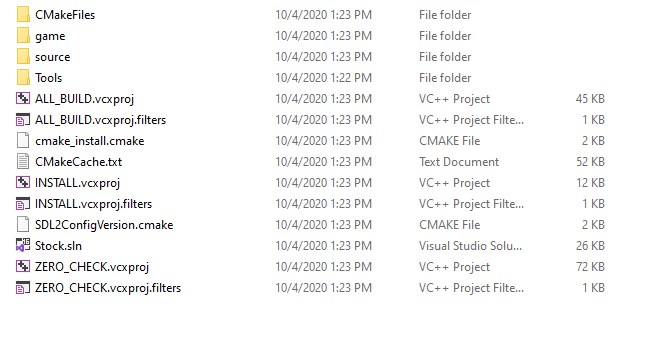
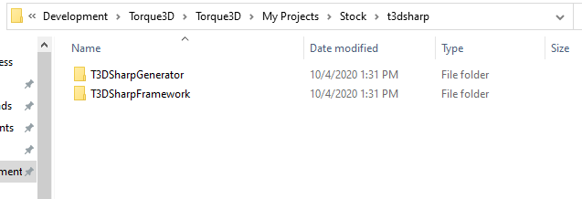
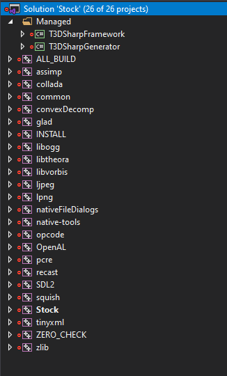
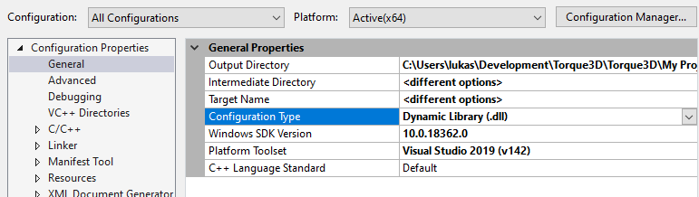
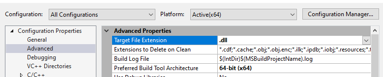
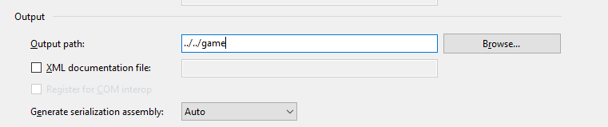
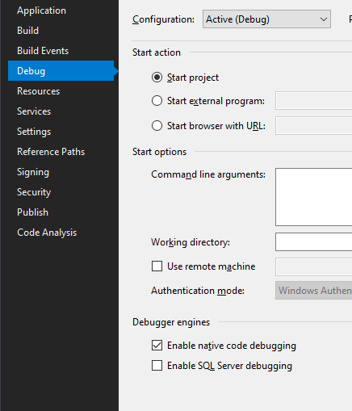
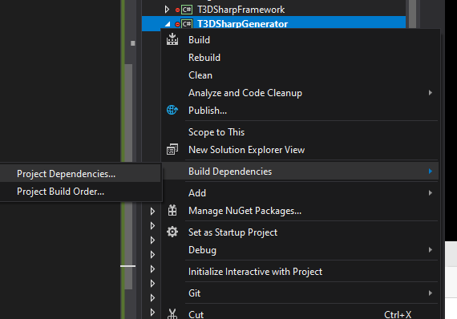

# Setup T3DSharp project

First of all, you should download and setup a Torque3D project. It shoud look like the image below:



Now create a new folder `t3dsharp` and either clone or copy-paste the two C# projects from this repo into it.



Now open up your T3D project in Visual Studio, add a new solution folder and call it whatever you want (I call usually default to calling it `Managed`). Then add the two `.csproject` files to this folder as shown below:

 

Now, first change the settings of the `Stock` project so it builds as a `.dll`. Right click and press _Properties_, then change _Configuration Type_ to `Dynamic Library`:



And then change the Target File Extension to `dll`:



Now, open up the `Program.cs` file in the _Generator_ project and change the Torque3D executable names to whatever you have chosen:

```c#
        public static void Main(string[] args) {
            
            CultureInfo customCulture =
                (CultureInfo) Thread.CurrentThread.CurrentCulture.Clone();
            customCulture.NumberFormat.NumberDecimalSeparator = ".";

            Thread.CurrentThread.CurrentCulture = customCulture;

            if (File.Exists("engineApi.xml")) {
                ParseEngineApi();
                return;
            }
            
            Initializer.InitializeTypeDictionaries(Assembly.GetExecutingAssembly().GetTypes());
            Torque3D.Libraries libraries = new Torque3D.Libraries
            {
                Windows32bit = "BaseGame_DEBUG.dll", // <- change these
                Windows64bit = "BaseGame_DEBUG.dll"  // <- only 64bit should be necessary really
            };

            Torque3D.Initialize(args, libraries);
        }
```

Then modify `outputDirectory` so it points to the folder where T3DSharpFramework lives, typically this would be the following example:

```            c#
            // Careful!!! Don't choose the wrong directory or it might get deleted..
            string outputDirectory = "../t3dsharp/T3DSharpFramework/Generated";
```

Now let's fiddle with the settings of the CSProjects. First change T3DSharpGenerator's output path to `../../game`:



Then under debug, enable _Native Code Debugging_:



For quality-of-life, you should add the _Stock_ project as a build dependency to the Generator:



Set the Generator project as the "Start-up Project" and run it.